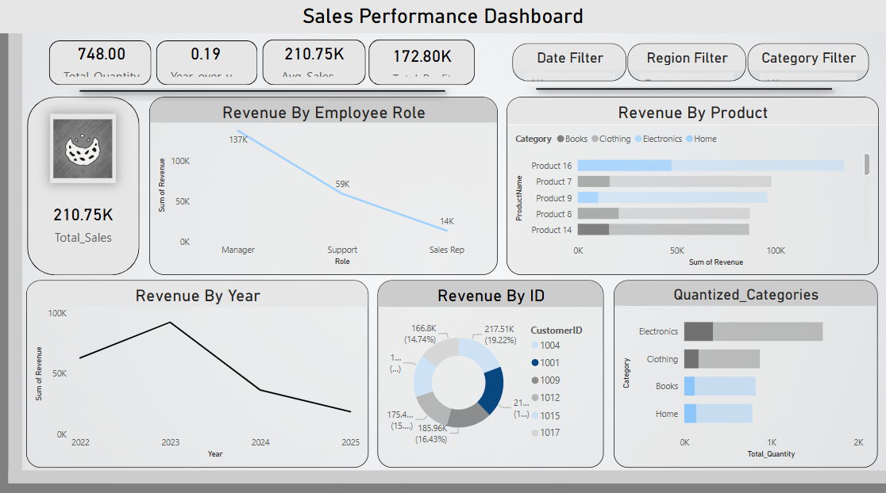
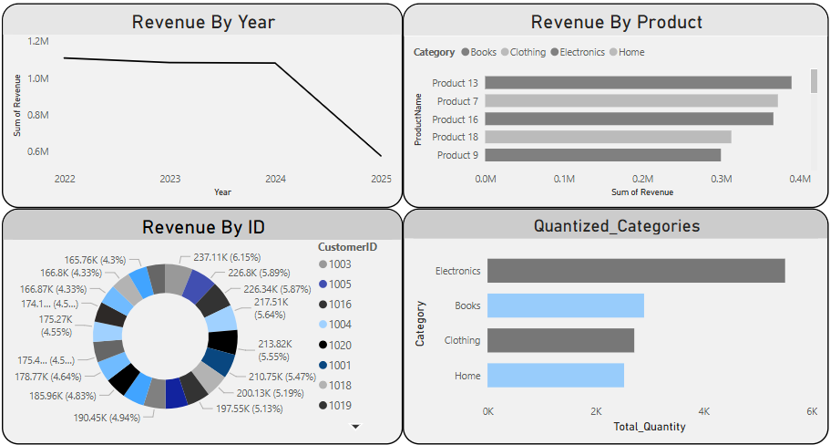
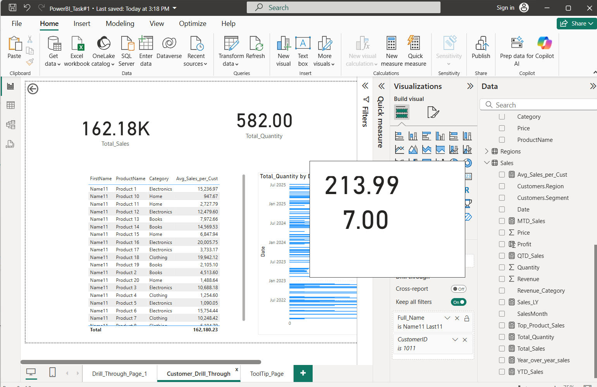
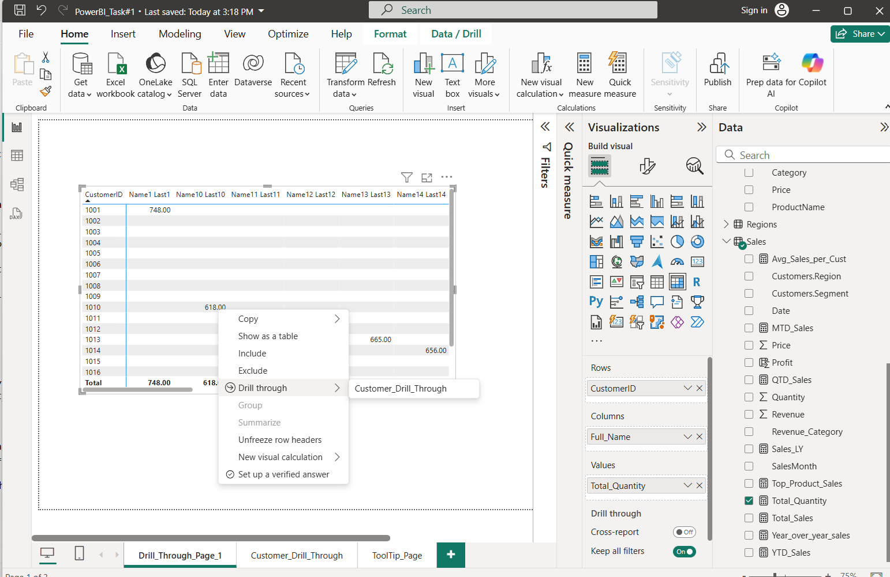

# 🛵 **Vespa Nation – Power BI Sales Performance Dashboard**

> **🚀 Interactive & Insightful Sales Dashboard Project**  
> Built in **Power BI Desktop** for the fictional brand **Vespa Nation**, this dashboard provides in-depth sales analysis, dynamic visuals, and sleek UX for business decision-makers.

---

## 🧰 Project Contents

| File                                                      | Description                                                          |
| --------------------------------------------------------- | -------------------------------------------------------------------- |
| 🗂️ `PowerBI_Task#1.pbix`                                 | Main Power BI file with visuals, filters, tooltips, and drillthrough |
| 📄 `Sale Data (2).xlsx`                                   | Raw sales dataset (Products, Employees, Customers, Sales)            |
| 📝 `Sale Data Task 1.txt` 📝 `Sale Data Task 1[1].txt` | Dashboard building notes, formulas, and documentation                |

---

## 🧠 What’s Inside?

| ✅ Task           | Description                                                     |
| ---------------- | --------------------------------------------------------------- |
| 📦 Data Modeling | Cleaned, transformed & modeled relational tables                |
| 🧮 DAX Measures  | `Total_Sales`, `Total_Quantity`, `YoY Change`, `Sales_LY`, etc. |
| 📊 Visuals       | Line charts, donut charts, bar charts, KPI cards                |
| 🎯 Filters       | Role, Category, Region, Segment                                 |
| 🧭 Navigation    | Bookmarks, drillthrough pages, tooltips                         |
| ✨ UI/UX          | Grey radiant theme, icons, logo, layout optimization            |

---

## 🎨 UI / UX Highlights

> 🧊 **Clean Layout** with rounded visuals & sections  
> 💠 **Radiant light grey** background  
> 🪄 **Modern KPI cards** with embedded icons  
> 📎 **Sticky filters** for fast exploration  
> 🪄 **Smooth transitions** using **Bookmarks**  
> 🖼 Custom Logo: `"Vespa Nation"` with soft shadows  
> 🧰 Tooltips for Products & Customer Cards  
> 🧪 Drillthrough Page per customer or category  

---

## 🖼️ Dashboard Snapshots

| Image                                                                 | Description                                                                     |
| --------------------------------------------------------------------- | ------------------------------------------------------------------------------- |
|  | 🧭 **Main Sales Overview Dashboard** KPIs, Revenue Trends, Customer Segments |
|  | 🔍 **Drillthrough Dashboard** Focused metrics by customer/category           |
|  | ⚙️ **DAX & Measure Setup**                                                      |
|  | 🧩 **Card Configuration & Chart Setup**                                         |

---

## 📊 Key Visuals in `Main Dashboard`

| 🔷 Visual           | Description                                                   |
| ------------------- | ------------------------------------------------------------- |
| 💳 **KPI Cards**    | Total Sales, Total Quantity, Avg Sales/Customer, % YoY Growth |
| 📈 **Line Chart**   | Revenue Over Time by Year                                     |
| 🧑‍💼 **Bar Chart** | Revenue by Employee Role                                      |
| 🛍️ **Bar Chart**   | Top Products by Revenue                                       |
| 📊 **Donut Chart**  | Top Customers by Revenue                                      |
| 🎯 **Stacked Bar**  | Quantity by Product Category                                  |

---

## 🎛️ Filters Used

| Filter      | Field                |
| ----------- | -------------------- |
| 🔹 Role     | `Employees[Role]`    |
| 📦 Category | `Products[Category]` |
| 🌍 Region   | `Customers[Region]`  |
| 🧾 Segment  | `Customers[Segment]` |

---

## 🎥 Animations & GIF Suggestions (Optional for GitHub / Portfolio)

To enhance visibility:

* ✅ Add a GIF screen recording (`dashboard_demo.gif`) of navigating dashboards
* ✅ Animate bookmarks toggling (Revenue ↔ Quantity)
* ✅ Highlight filter interactivity
* ✅ Showcase drillthrough & tooltips in action

You can use [ScreenToGif](https://www.screentogif.com/) or PowerPoint Export > MP4 > GIF.

---

## 💡 Suggested Additions

| Feature                    | Purpose                                           |
| -------------------------- | ------------------------------------------------- |
| 🔁 Reset Filters Button    | Improve user workflow                             |
| 🧭 Page Navigation Buttons | Between Dashboard 1 & 2                           |
| 📌 Sidebar Icons           | Navigation shortcut (Home, Filters, Drillthrough) |
| 📦 Export to PDF / Print   | For stakeholder reporting                         |

---

## 🧾 Footer

Created by **Muhammad Haseeb**  
Power BI Dashboard Project for Vespa Nation  
📅 July 2025
---
